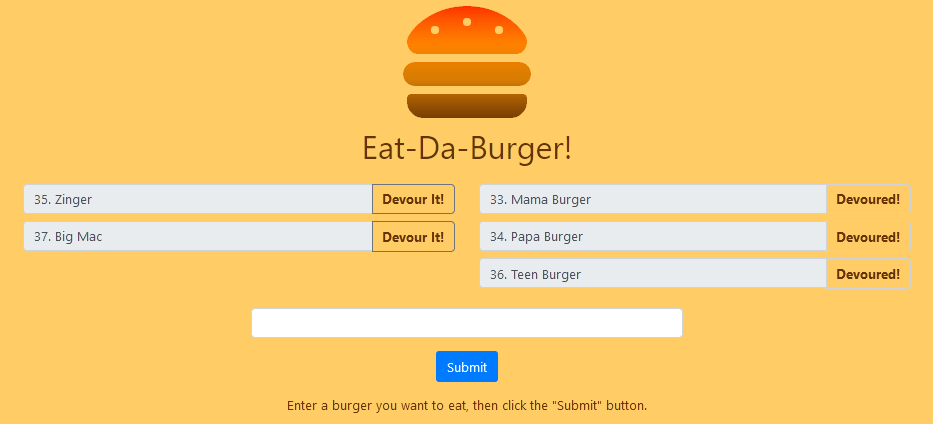

# Eat-Da-Burger
This whimsical app allows a user to keep track of burgers they have eaten, or would like to eat.

It's a full-stack application constructed using the Model-View-Controller (MVC) paradigm.

Node and Express were used to implement the server. Handlebars was used as the view engine. MySQL and a homemade Object-Relational Model (ORM) were used to keep track of burgers in the database. The front-end was made using HTML, Bootstrap, Fontawesome, and Javascript. The application has been deployed to the cloud service Heroku.

## Usage
Use the form to submit the name of a burger you'd like to eat. Uneaten burgers are displayed on the left side of the screen, while eaten burgers are shown on the right. Click on the 'Devour It' button next to each uneaten burger to shift it to the right side.



## MVC
The application was implemented using the MVC paradigm.

Here's the directory structure of the application:
```
.
├── config
│   ├── connection.js
│   └── orm.js
│
├── models
│   └── burger.js
│ 
├── controllers
│   └── burgers_controller.js
│
├── views
│   ├── index.handlebars
│   └── layouts
│       └── main.handlebars
│
├── public
│   └── assets
│       ├── css
│       │   └── style.css
│       └── js
│           └── script.js
│
└── server.js
```
Below I discuss the role of each of the files within the MVC framework. 

### Model
* `config/connection.js` establishes a connection with the mysql database.
* `config/orm.js` is a homemade generic ORM. By generic I mean that it's not aware of the schema used in the database to which it speaks. This ORM implements the following functions: `selectAll()`, `insertOne()`, and `updateOne()`. Information about the tables and columns to be operated on must be passed in as function parameters.
* `models/burger.js` is the schema-aware model implemented on top of `config/orm.js`. It implements functions to get, add, and update burger information in the database.

### View
* `views/` contains the handlebar template files. (`express-handlebars` is the view engine used by the application to generate the HTML which is sent to the user's web browser.)
* `public/` contain css and javascript which gets plugged into the pages generated by the view engine. 

### Controller
* `controllers/burgers_controller.js` is the glue between the Model and View. It accepts user inputs via the server endpoints: GET, POST, and PUT requests to pre-defined URLs. Based on the user's input, the model (`models/burger.js`) is invoked to modify the burgers in the database. The view engine is then invoked to render an HTML file that shows the updated information from the database.
* `server.js` is the top-level server file that also helps to tie the pieces of the application together. It starts the `express` server, specifies `express-handlebars` as the view engine, and uses `controllers/burgers_controller.js` to establish the server endpoints. 

### Separation of Concerns
The MVC structure allows for a separation of concerns ... meaning subsets of files within the project have specific roles which are independent of other parts of the project. For instance, I can swap out the homemade ORM with a third-party ORM and not have to make any changes to the View or Controller parts of the application. For this reason the MVC structure is a helpful tool to manage the complexity of software projects. 

## Try It
You can give the application a spin [here](https://radiant-basin-63106.herokuapp.com).